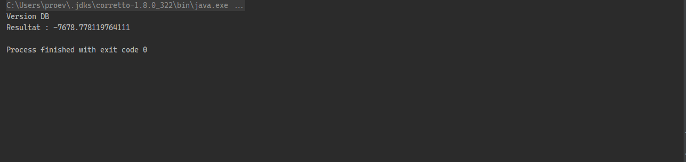
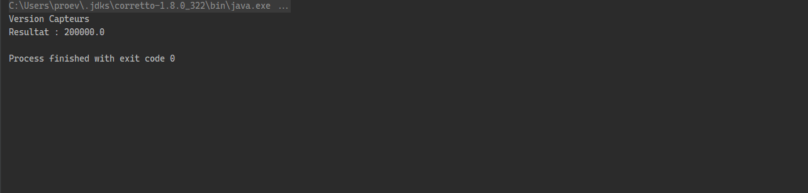
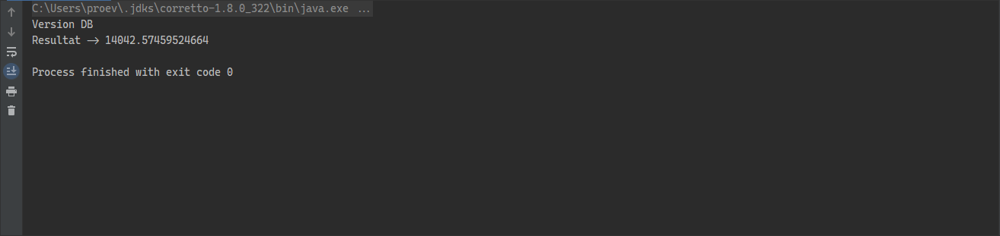
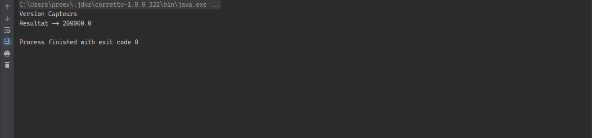

# 1.Introduction

# 2.Enonce

1. Create the IDao interface

2. Create an implementation of IDao

3. Create the IMetier interface

4. Create an implementation of IMetier

5. Create the Presentation layer by injecting the dependencies:
   
   1. By static instantiation
   
   2. By dynamic instantiation
   
   3. By using Spring Framework: XML and Annotation version

# 3.Conception

# 4.Source Code

[Source Code](https://github.com/SalahEddineGuenna/JEE/tree/main/EMSI_ioc)

# 5.Screen Shots

## 1.Using Static instanciation:

database version :

sensors version :

## 2.Using Dynamic instanciation:

database version:

sensors version:

# 6.Conclusion

In this work, we applied the concept of application closed to midifications, and open to extension, and saw how good that concept is. We also showed how to do a static and dynamic instanciations.
