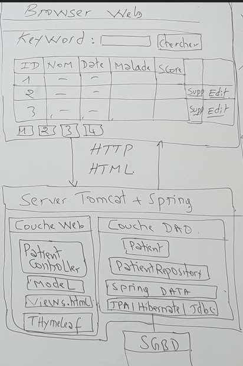
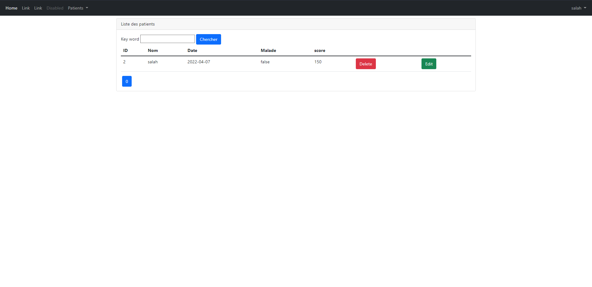
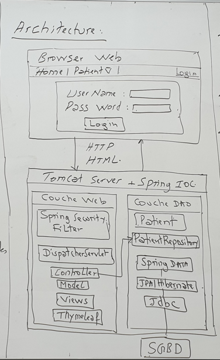
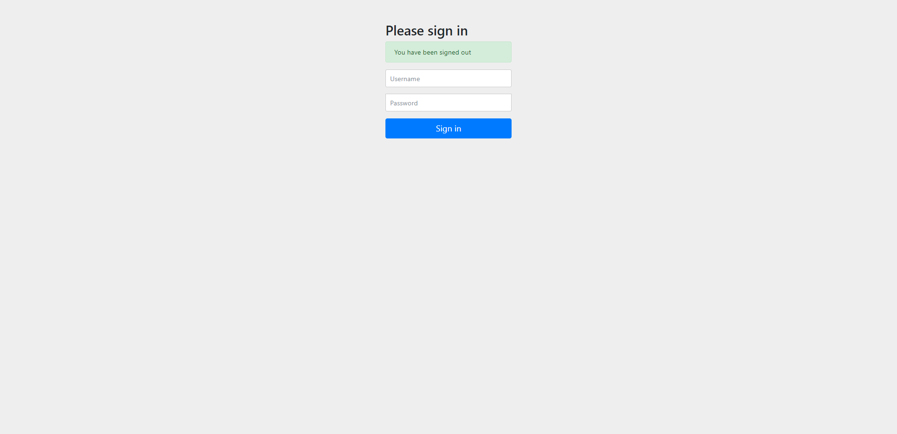
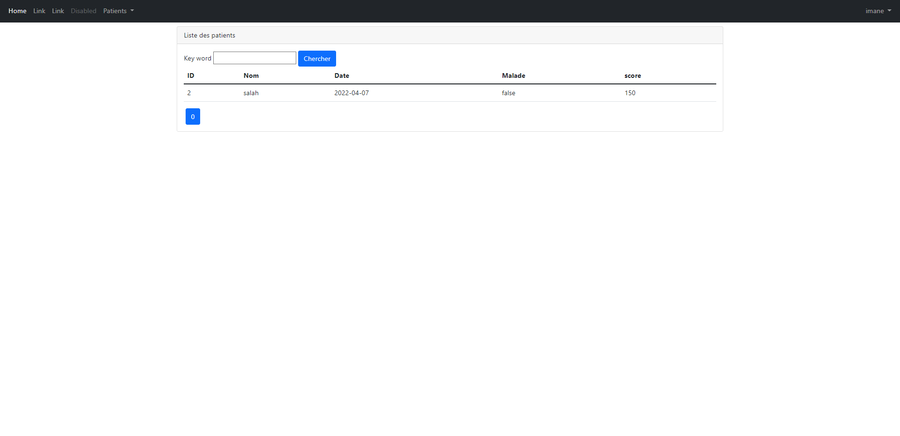

<h1> Activité pratique N°3 JEE : Spring MVC, Thymeleaf, Spring Data et Spring Security
</h1>
<h2 style="text-decoration: underline;">1- objectif:</h2>

Développer une application web baseé sur Sprint MVC, ThymeLeaf et Spring Data qui permet de gérer des patients.

L' Application doit permettre de : 

<ul>
<li> Chercher des Patients avec Pagination  </li>
<li> Supprimer un Pateint </li>
<li> Ajouter un Payient avec validation du formulaire </li>
<li> Editer et Mettre A jour un Patient </li>
<li>cree une page Template basée sur Thymeleaf Layout</li>
</ul>

<h2 style="text-decoration: underline;">2- Architecture :</h2>

<h2 style="text-decoration: underline;">3- Travail a faire</h2>

<ol type="1">

<dt><li> Cree un projet Spring Boot avec les dépendances </li></dt>
<dd>Spring DATA JPA , H2, Web ,themeleaf st Lombok </dd>
<dt><li>Créer La couche DAO</li></dt>
<dd>
<ul>
<li>Cree l'entite jpa Patient</li>
<li> cree L'interface Patient Repository basée sur Spring DAta </li>
<li>Tester la couche Dao</li>
</ul> 
</dd>
<dt><li>Créer la couche web </li></dt>
<ul>
<dd><li> Creer le controleur Spring MVC</li>
<li>Cree les vue basee sur le moteur de Templates Thymeleafe </li>
</dd>
</ul>
</ol>

<h2 style="text-decoration: underline;">4- Resultats :</h2>

dans cette page en trouve la liste des patients avec pagination

 
<h1>  Spring Security : Activité pratique N°4 ; Spring Boot Spring MVC Thymeleaf Spring Securiry User Details Service: </h1>

            <h2 style="text-decoration: underline;">1- objectif:</h2>
        

            Sécuriser L'accés a l'Application 
            qui permet de géer les Patients en utilisant Spring Security . L'accées à L'aplication nécessite une Authentification avec
            un Username et mot de passe .un utilisateur peut avoir plusieurs Role ;
        

        <dl>
          <dt>ROLE_USER:</dt>
          <dd >-permettant de chercher des patients</dd>
          <dt>Role_ADMIN</dt>
          <dd>- permettant d'ajouter, mettre àajour et supprimer les patients</dd>
        </dl>

 <h2 style="text-decoration: underline;">2- Architectur :</h2>
    

<h2 style="text-decoration: underline;">2- Travail a faire :</h2>

 

<ol type="1">
  <li>Ajouter la dépendance maven de Spring Security  </li>
  <li>Personnaliser la configuration de Spring Security Suivantes avec la Startégie InMemoryAuthentication  
<dl>
  <dt>-Auhtentification avec le Role USER pour pouvoir Consulter Les Patients</dt>
  <dt>-Authentification Avec le role ADMIN pour pouvoir Ajouter ,Editer,mettre à  jour et supprimer des Patients </dt>
    <dt> -permettre l'accés aux ressources statique (/webJars/**) sans aucune authentification </dt> 
</dl>
</li>

<li> Basculer de La Statégie InMemory Authentification Vers JDBCD Authentification </li>
<li>Basculer Vers La Stratégie UserDetailsService </li>

</ol>

<h2 style="text-decoration: underline;">3- Resultats :</h2>

pour la page de login , on peut voir le formulaire de login avec les champs username et password

aprés authentification, et si le user a le role ADMIN, il peut ajouter, editer, supprimer des patients

alors pour un utilisateur avec le role USER, il peut que consulter les patients

